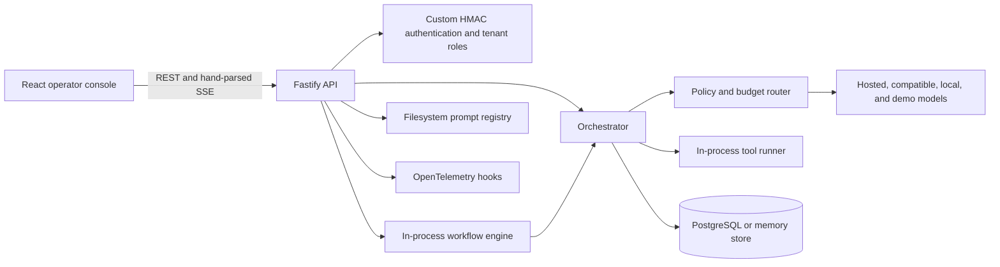
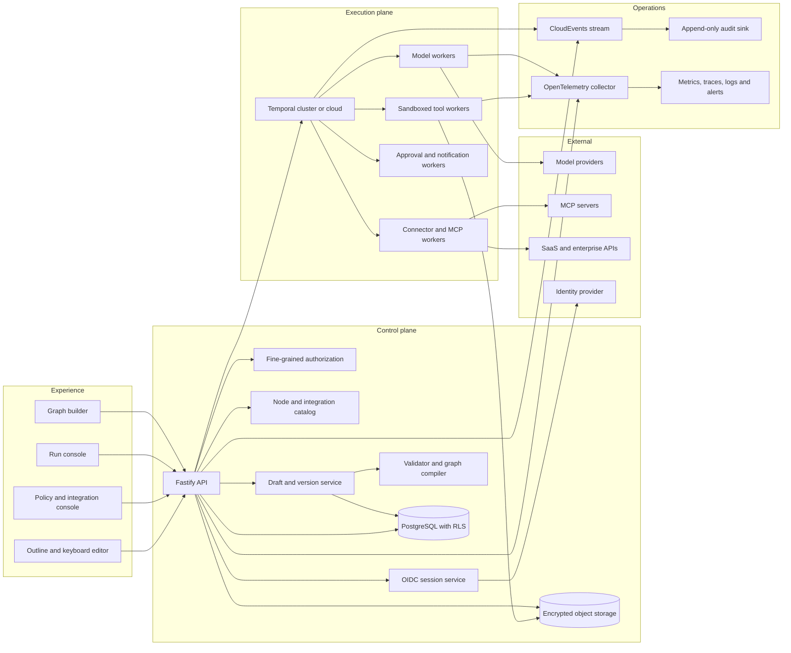
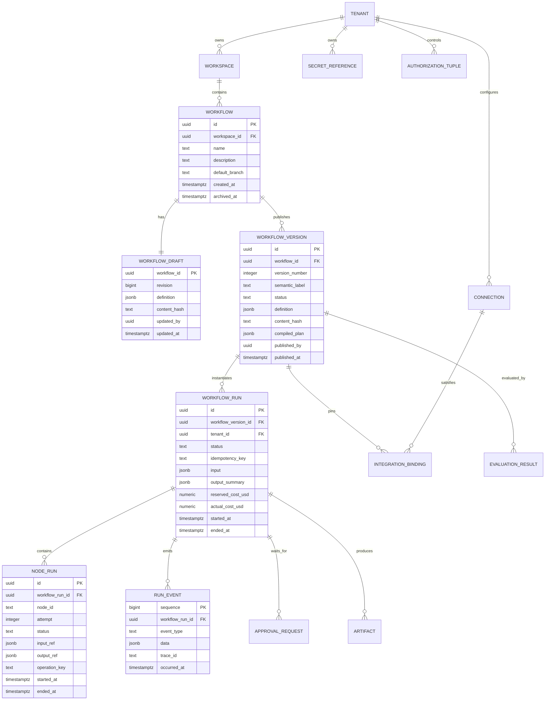
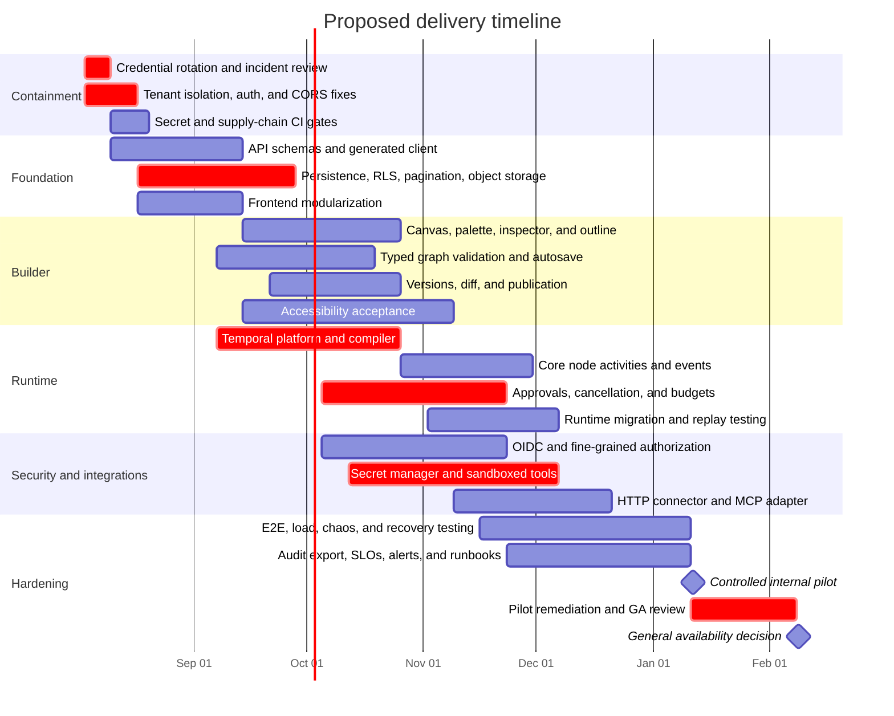

# Critical Audit and Target Design for a Controllable Copilot-Style Workflow Platform

## Executive summary

The uploaded file was treated as a source repository archive because it is a ZIP file containing a TypeScript monorepo. The repository is a credible prototype of an AI control plane: it has a React operator console, Fastify API, provider adapters, PostgreSQL persistence, tool approval concepts, workflow jobs, OpenTelemetry hooks, Docker and Kubernetes assets, and a small automated test suite. It is not production-ready as a multi-tenant, fully controllable Copilot-like platform.

The most urgent finding is operational rather than architectural: the ZIP contains a `.env` file with non-empty OpenAI, Anthropic, Gemini, authentication, local API, and database credentials. No values are reproduced here. Every credential present in the archive must be treated as exposed and rotated immediately. The archive also contains `.git`, dependency directories, build output, logs, and caches. That turns a roughly 1.1 MB source tree into a 71 MB compressed archive and a roughly 301 MB extracted directory, while leaking unnecessary repository and runtime context.

The second critical finding is a likely cross-tenant data-isolation defect in `PostgresStore.session()`. An existing session ID can be returned even when requested under a different tenant because the conflict path does not assert that `sessions.tenant_id` matches the caller’s tenant, and the subsequent message query filters only by session ID. This is a release blocker for any multi-tenant deployment.

The existing “workflow builder” is not a graph builder. It is an ordered, draggable list of prompts with four templates. It cannot model branches, joins, typed ports, loops, error paths, subworkflows, human forms, compensations, durable waits, connector bindings, or versioned execution plans. The runtime similarly supports only single, planner-reviewer, and short sequential ad hoc jobs. Calling the current implementation a durable workflow platform overstates what the code actually guarantees.

The recommended direction is evolutionary rather than a rewrite:

| Area | Recommendation |
|---|---|
| Web application | Keep React and TypeScript; split the monolithic console into feature modules and use React Flow for the canvas |
| Client state | TanStack Query for server state; Zustand for transient canvas state; XState only for complex interaction modes |
| API | Keep Fastify; introduce OpenAPI-first request and response contracts, generated clients, consistent authorization, pagination, idempotency, and ETags |
| Persistence | Keep PostgreSQL; add explicit tenant scoping, row-level security, immutable workflow versions, optimistic concurrency, and object storage for artifacts |
| Durable runtime | Replace the in-process lease loop with Temporal TypeScript workflows and activities |
| Authorization | OIDC or SAML through an identity provider, plus fine-grained resource authorization such as OpenFGA |
| Tools and agents | Signed internal manifests, sandboxed workers, explicit network and secret policies, and an MCP adapter rather than unrestricted MCP execution |
| Events | CloudEvents envelopes and AsyncAPI contracts; introduce NATS JetStream only when multiple independent consumers or event replay justify it |
| Observability | OpenTelemetry traces, metrics, and structured logs with run, node, tenant, model, tool, and cost correlation |
| Delivery | First contain the security defects, then build versioned workflow definitions and the canvas, then migrate execution to a durable runtime |

A realistic delivery estimate is **approximately 72–96 person-weeks**, spread across **22–26 calendar weeks** with a stable five-to-six-person cross-functional team. A secure internal alpha can be produced earlier, around calendar week twelve, but it should not be called generally available until tenant isolation, tool isolation, durable execution, access control, audit export, browser testing, accessibility, and recovery testing are complete.

## Audit scope, assumptions, and baseline

**Observed file and repository assumptions.** The uploaded artifact is `/mnt/data/cli.zip`. It was inspected as a Git repository snapshot rather than as a standalone executable. The implementation is primarily TypeScript, organized as a pnpm-workspace and Turborepo monorepo. The principal directories are:

```text
apps/web                     React 19 and Vite operator console
services/api                 Fastify HTTP and SSE control plane
services/orchestrator        Model routing, persistence, approvals, traces
services/tool-runner         Tool schema validation and execution
services/workers             Job and evaluation execution
packages/adapters            Hosted, compatible, local, and demo model adapters
packages/contracts           Shared TypeScript and Zod contracts
packages/prompts             Prompt registry
infra/postgres               Database schema and migrations
infra/docker                 Container definitions
infra/kubernetes             Deployment, Service, HPA, PVC, and Ingress examples
docs                         Architecture, security, deployment, and provider notes
evals                        Smoke evaluation dataset
```

The repository contains approximately 2,279 lines of TypeScript and TSX application code and approximately 201 lines of test code. Twenty test cases were found. Because the archive bundles dependency directories and generated material, it contains more than 20,000 files even though the source-only tree has roughly 120 files.

**Verification limitation.** Static inspection was completed. A clean build and test reproduction could not be completed in the audit environment because pnpm was not installed, Corepack attempted an unavailable external download, and dependency links inside the archived `node_modules` tree were broken by packaging and extraction. Existing generated output and logs are not accepted as independent proof that the current commit passes. Therefore, findings about code paths are high-confidence static findings; statements about runtime behavior should be confirmed in a clean, network-enabled CI environment.

**Current architecture.**



The separation into contracts, adapters, orchestration, tool execution, workers, API, and UI is directionally sound. The adapter interface normalizes provider behavior, the code has a recognizable control-plane boundary, the database schema includes useful operational concepts, and the repository includes deployment and security notes. Those are meaningful positives.

The weakness is that several package names and documentation claims imply stronger guarantees than the implementation provides. For example, `services/workers` is described as durable, but execution is initiated through process-local timers and a lightweight database lease. Audit events are described as immutable even though they are ordinary database rows included in retention deletion. Trace replay does not pin all inputs that affected the original output. The evaluation API deliberately disables most external-provider configuration and is closer to a deterministic smoke path than a production model-regression system.

**Readiness scorecard.** These scores are an engineering judgment based on the supplied snapshot, not a standardized certification.

| Dimension | Score | Assessment |
|---|---:|---|
| Architecture | 2.5 / 5 | Good package intent; execution, contracts, tenancy, and deployment boundaries are not yet strong enough |
| Code quality | 2 / 5 | Small and understandable, but highly compressed, weakly typed in persistence, and inconsistent about validation |
| User experience | 2 / 5 | Broad operator-console coverage, but the builder is a list rather than a workflow canvas and accessibility is incomplete |
| Security | 1 / 5 | Credentials in archive, tenant-isolation defect, permissive CORS, browser token exposure, and unsandboxed tools |
| Dependencies and supply chain | 2 / 5 | Lockfile and pinned package-manager version exist; security scanning, provenance, SBOM, update automation, and clean packaging do not |
| Tests | 1.5 / 5 | Useful basic service tests, but insufficient adversarial, UI, accessibility, concurrency, recovery, and provider-contract coverage |
| Performance | 2 / 5 | Fine for a small prototype; repeated polling, N+1 reads, full-history rewrites, and synchronous health calls will not scale |
| Scalability | 1.5 / 5 | Stateless API aspirations conflict with process-local workers, limiters, filesystem promotion, and memory-store fallbacks |
| Maintainability | 2 / 5 | Clear top-level boundaries but monolithic files, duplicated contracts, `any` row mappers, and missing API specifications |
| Documentation | 3 / 5 | Better than typical prototypes, but capability claims exceed implementation and operational runbooks are absent |
| Feature completeness | 1.5 / 5 | Chat control plane exists; full workflow authoring, durable execution, enterprise identity, connectors, and lifecycle management do not |

## Critical findings and concrete fixes

Severity is defined as follows: **Critical** means immediate containment or release blocking; **High** means likely security, correctness, cost, or major availability impact; **Medium** means material operability, performance, maintainability, or UX impact; **Low** means limited impact or cleanup. OWASP ASVS is an appropriate general application-security verification baseline, while OWASP’s LLM guidance is directly relevant to prompt injection, output handling, tool agency, and resource consumption. NIST’s Generative AI profile provides a broader Govern–Map–Measure–Manage risk framework for model-dependent behavior. citeturn1search0turn1search1turn1search2turn1search10

| ID | Area and evidence | Why it matters | Severity | Concrete fix |
|---|---|---|---|---|
| F-01 | **Credentials and repository internals are packaged in the ZIP.** A non-empty `.env` includes provider credentials and `AUTH_SECRET`; `.git`, `node_modules`, logs, build output, and caches are also included. | Anyone with the ZIP may be able to use the exposed credentials, impersonate sessions, inspect deleted Git objects, or mine local runtime data. Ignoring `.env` in Git does not protect a manually created archive. | **Critical / P0** | Immediately revoke and replace every value in the archived `.env`; invalidate all existing signed sessions; inspect provider usage and audit logs; create a clean source export with `git archive`; add secret scanning to CI and pre-commit; document an incident record. |
| F-02 | **Cross-tenant session access is possible.** `services/orchestrator/src/postgres-store.ts:15-22` inserts a session using `ON CONFLICT (id)` without verifying tenant equality, then reads messages using only `session_id`. `saveMessages()` has the same conflict pattern at lines 31–38. | A guessed, logged, or otherwise known UUID could expose another tenant’s session and messages or allow destructive replacement of its message history. Application-layer tenant checks are ineffective if the persistence method itself can return a foreign row. | **Critical / P0** | Require `tenant_id` in every persistence key and predicate; reject conflict rows owned by another tenant; join message reads through a tenant-scoped session; add composite constraints where appropriate; enable PostgreSQL row-level security; add negative cross-tenant tests for every resource type. PostgreSQL supports table-specific policies with `USING` and `WITH CHECK` expressions and defaults to denying access when RLS is enabled without an applicable policy. citeturn4search0turn4search4turn4search16 |
| F-03 | **Tool execution is in-process and not sandboxed.** `services/tool-runner/src/runtime/execute.ts` provides schema validation and a cooperative timeout but no process, container, CPU, memory, filesystem, network, output-size, or secret boundary. | A buggy or malicious custom tool can read server memory, access broad credentials, call arbitrary networks, consume resources, or block the API process. An `AbortSignal` cannot stop code that ignores it. | **High / P0–P1** | Move tools to isolated worker pools or short-lived sandboxes; use per-tool identities and secret scopes; default-deny egress; enforce CPU, memory, wall-clock, input, output, and artifact limits; sign and version manifests; require explicit capability grants and approval policy. Kubernetes NetworkPolicy can restrict pod ingress and egress when the cluster’s network plugin enforces it. citeturn4search2turn4search14 |
| F-04 | **Authentication has unsafe deployment defaults.** `services/api/src/app.ts:46` supplies a development principal when auth is optional. `services/api/src/auth.ts` uses a custom HMAC token and a development secret path. The web client stores its bearer token in `sessionStorage` at `apps/web/src/api.ts:20-25`. | A misconfigured production deployment can become implicitly authenticated. Browser-readable bearer tokens are available to successful XSS. A custom token system lacks mature issuer, audience, key rotation, revocation, federation, MFA, and lifecycle controls. | **High / P0–P1** | Fail startup in production unless auth is explicitly required and a strong secret or OIDC configuration exists; replace browser bearer storage with `HttpOnly`, `Secure`, `SameSite` cookies plus CSRF protection, or use an audited OIDC browser flow; add issuer, audience, key ID, rotation, revocation, session version, and login audit controls. |
| F-05 | **CORS is permissive and inconsistent.** `services/api/src/app.ts:30` registers `{ origin: true }`; streaming manually emits `access-control-allow-origin: *` at line 75. | Dynamic origin reflection and wildcard streaming widen the browser attack surface and conflict with credentialed authentication. Hand-managed CORS headers can diverge from framework policy. | **High / P0** | Parse an explicit `CORS_ALLOWED_ORIGINS` allowlist at startup; reject wildcard origins in production; let one framework plugin set all CORS headers; test allowed, denied, preflight, and streaming paths. |
| F-06 | **Request validation is inconsistent.** Chat uses Zod, but bootstrap, login, policy update, jobs, approvals, artifacts, and several other handlers cast `request.body`. The policy update trusts a caller-supplied `TenantPolicy`, including provider lists and budget values. | Invalid or hostile inputs can create impossible policies, negative budgets, oversized values, unsafe media types, brittle errors, or later crashes. Validation after persistence is too late. | **High / P0–P1** | Define Zod or TypeBox schemas for every path, query, body, response, and event; derive OpenAPI from the same source; enforce UUIDs, lengths, enums, non-negative budgets, strict objects, MIME allowlists, and payload limits; return stable error codes. JSON Schema 2020-12 provides a standard vocabulary for structural and semantic validation. citeturn3search2turn3search18 |
| F-07 | **Approval continuation appears incorrect for multiple tool calls.** In the orchestrator, pending calls are recorded, but resolution resumes with only the just-resolved tool result once no approvals remain. Results for other approved calls are not reliably reconstructed and executed. | Multi-tool turns can lose outcomes, resume with incomplete model context, or skip approved side effects. This creates silent correctness failures in the exact path meant to provide human control. | **High / P0–P1** | Model a turn as an explicit persisted state machine; persist every tool call and its result; execute each approved call exactly once using an idempotency key; resume only after all required terminal outcomes exist; append all tool-result messages in original call order; add tests for approve-all, mixed approve/reject, duplicate resolution, and process restart. |
| F-08 | **Retries and side effects lack idempotency.** Model retries use short fixed delays, and tool/model operations do not have durable request keys. | Network ambiguity can duplicate emails, writes, tickets, purchases, or other side effects. Fixed, nearly immediate retries amplify provider incidents and rate limiting. | **High / P1** | Generate a stable operation ID for each node attempt; require connector-side idempotency support where available; store attempt records and terminal outcomes; use bounded exponential backoff with jitter, deadlines, retry classification, circuit breakers, and dead-letter handling. |
| F-09 | **The workflow worker is co-located with the API and only weakly durable.** `services/workers/src/index.ts` launches work through process-local timers and tracks active work in a process-local set. Leases have no robust heartbeat, and cancellation does not abort an active provider call. | API restarts, long calls, network partitions, or horizontal scaling can produce delayed recovery or duplicate execution. CPU-heavy or blocked work affects HTTP latency. | **High / P1** | Separate API and workers; use a durable orchestration engine with event history, signals, heartbeats, retries, and worker versioning; pass cancellation to provider and tool operations; isolate queues by workload class and tenant. Temporal records workflow event history and resumes executions after crashes; its workers, task queues, timeouts, retries, and heartbeats directly address these requirements. citeturn0search20turn0search23turn0search29 |
| F-10 | **Budget enforcement is race-prone and incomplete.** The orchestrator checks spend before invocation without reserving estimated cost atomically. Usage is primarily recorded after successful calls. | Concurrent requests can all pass the same remaining-budget check and exceed the limit. Failed or abandoned calls may still incur provider cost but remain unaccounted. | **High / P1** | Introduce budget reservations in a transaction or atomic ledger; reserve estimated maximum cost before dispatch; settle against actual usage; release unused reservation; include failures and retries; enforce per-run, per-node, daily, monthly, token, concurrency, and rate limits. Unbounded model and tool consumption is a recognized LLM application risk. citeturn1search25 |
| F-11 | **Streaming fallback can corrupt output.** Deltas may be sent to the browser before a provider fails, after which a fallback provider can emit a second answer. The SSE server has no heartbeat, event IDs, resumption, or robust disconnect cancellation. | Users may see concatenated or contradictory answers. Lost connections cannot resume, and model work may continue after the client leaves. | **High / P1** | Buffer until a provider crosses a configurable commit boundary, or prohibit provider fallback after the first visible token; send `id`, `event`, and structured `data`; issue heartbeats; abort work on disconnect; expose a resumable run-event stream rather than treating a request socket as the execution record. |
| F-12 | **Artifacts are trusted too early.** Upload checks are based largely on JSON serialization size. A session lookup can create rather than merely validate a session. Text attachments are injected directly into prompts. Artifact content is stored inline in JSONB. | Uploaded content can carry prompt injection, hostile structured data, oversized expansion, or sensitive information. Inline storage degrades backups and database performance. Session-creation-on-validation weakens authorization semantics. Prompt injection and insecure handling of model/tool output are core LLM risks. citeturn1search13turn1search37 | **High / P1** | Separate `getSession` and `createSession`; validate tenant ownership without mutation; use object storage with checksums, encryption, malware scanning, parser isolation, content-type detection, and quarantine; treat attachment text as untrusted data with explicit delimiters and policy; cap extracted text and archive expansion. |
| F-13 | **Trace replay is not deterministic.** Replay reruns a recent user message without pinning the full prompt version, agent definition, model revision, tool versions, policy snapshot, temperature, seeds, provider parameters, or retrieved context. | “Replay” can produce unrelated results and cannot prove regression, incident reproduction, or audit causality. | **High / P1** | Persist an immutable execution manifest containing workflow version, prompt hashes, model/provider parameters, tool manifests, policy snapshot, retrieval references, input hashes, and environment version; distinguish `replay` from `rerun`; label non-deterministic comparisons honestly. |
| F-14 | **Evaluation coverage is mainly smoke-level.** The API evaluation path disables most external-provider configuration, and the repository has no serious regression, safety, quality, or cost dataset. | A deterministic demo adapter can pass while real providers, prompts, tools, routing, and safety controls regress. | **High / P1–P2** | Create versioned datasets for routing, tool selection, prompt injection, structured output, refusal boundaries, cost, latency, and tenant policy; support provider contract tests with controlled quotas; compare against baselines with confidence intervals and explicit promotion gates; retain evaluation provenance. |
| F-15 | **The current builder is not a workflow graph.** `apps/web/src/App.tsx` exposes a fixed set of prompt-step templates in an HTML drag list. It lacks ports, edges, branches, joins, typed data, graph validation, zoom, minimap, versioning, and test mode. | Users cannot express the workflows implied by the product goal. Positional dragging alone excludes keyboard and many assistive-technology users. WCAG 2.2 requires a non-dragging alternative for functionality that uses dragging, and W3C guidance describes keyboard-operable reordering. citeturn1search3turn1search11turn1search23 | **High / P1–P2** | Replace the list with a node-and-edge canvas plus an equivalent outline view; provide keyboard move/connect commands; add typed ports, graph validation, branch and join blocks, undo/redo, versioning, run simulation, and publish controls. React Flow supports custom nodes and edges, viewport controls, keyboard focus, and accessibility attributes, making it the lowest-risk fit for the existing React stack. citeturn0search0turn0search7turn0search10 |
| F-16 | **The front end is monolithic and polling-heavy.** Many pages, state transitions, and controls are compressed into `App.tsx`; a refresh retrieves around a dozen resources; regular polling continues regardless of change rate. The API client duplicates server contracts and contains a simplistic SSE parser. | Small changes create wide regression risk. Polling increases API and database load and still produces stale data. Hand-copied contracts drift. A partial SSE frame or multiline data field can be parsed incorrectly. | **Medium / P1–P2** | Split by feature and route; generate clients from OpenAPI; use TanStack Query for caching, invalidation, retries, and request deduplication; switch runs, approvals, usage, and audit activity to event-driven updates; use a standards-compliant SSE client or WebSocket protocol. TanStack Query is explicitly designed to manage the lifecycle and cache of asynchronous server state. citeturn6search0turn6search16 |
| F-17 | **Database access has avoidable scaling and concurrency problems.** Session listing performs an initial query and then one transaction per session; message saves delete and reinsert the full history; list APIs often have no cursor; artifacts and job state can grow as JSONB blobs. | Latency and database load grow with history size. Concurrent saves can overwrite each other. Large JSONB values make vacuuming, replication, backup, and query behavior less predictable. | **Medium / P1–P2** | Fetch sessions and messages in bounded set-based queries; append messages rather than rewriting them; add optimistic version columns; use keyset pagination; keep large artifacts in object storage; cap state and event payloads; add indexes based on measured query plans. |
| F-18 | **Prompt and agent configuration is not safely multi-tenant.** Agents are read and parsed from a filesystem JSON file on selection; prompt promotion mutates a shared filesystem registry. Kubernetes relies on a shared writable volume. | Promotion from one tenant can affect another tenant. Multiple replicas can disagree or contend. Invalid JSON can break requests. Filesystem mutation complicates rollback, audit, and immutable deployment. | **High / P1–P2** | Store tenant-scoped immutable prompt and agent versions in PostgreSQL or object storage; validate on write; cache by content hash; promote by changing a database alias in a transaction; pin versions in workflow definitions; prohibit mutation of packaged application files. |
| F-19 | **Audit records are not immutable.** Audit events are normal rows, and retention purge includes old audit events. No external append-only sink, hash chain, write-once storage, or integrity verification is implemented. | A database administrator or compromised application path can alter or delete evidence. Calling the log immutable creates false compliance confidence. | **High / P1–P2** | Rename the current feature to “application audit log” unless immutability is implemented; export events to a separate append-only security account or WORM-capable store; use monotonic sequencing, hash chaining, retention locks, access separation, and periodic integrity checks. OWASP recommends deliberate security-event logging and protection of logs from tampering and unauthorized access. citeturn1search8 |
| F-20 | **Tests do not cover the principal risks.** There are no browser component or end-to-end tests, accessibility automation, adversarial tenant tests, load tests, property tests, migration rollback tests, chaos tests, or comprehensive concurrency tests. | The highest-impact failures—data leakage, duplicate side effects, broken approvals, inaccessible editing, and recovery errors—can ship undetected. | **High / P0 onward** | Add tenant-isolation tests first; then API schema, approval state-machine, budget concurrency, idempotency, lease recovery, cancellation, browser E2E, accessibility, provider contract, migration, load, and chaos suites. Enforce coverage for changed code and critical packages rather than chasing one repository-wide percentage. |
| F-21 | **CI lacks major quality and supply-chain gates.** CI runs type checks, tests, an evaluation, builds, and container builds, but no linting, formatting, coverage threshold, secret scan, SAST, dependency review, license policy, SBOM, image scan, IaC scan, or signed provenance. | Vulnerable or unlicensed dependencies, secrets, unsafe container layers, and malformed infrastructure can pass while the build remains green. | **High / P0–P2** | Add ESLint, formatting, coverage, secret scanning, CodeQL or equivalent SAST, dependency review, license allowlist, CycloneDX or SPDX SBOM, container and IaC scanning, pinned actions, digest-pinned base images, and signed build provenance. SLSA defines progressively stronger provenance and hardened-build guarantees. citeturn4search7turn4search11 |
| F-22 | **Dependency and environment drift are likely.** Manifests use caret ranges, the lockfile pins concrete versions, and archived dependency content does not cleanly match the declared package-manager environment. | Local, CI, and container behavior can diverge. Bundled dependencies may be stale, platform-specific, or compromised. | **Medium / P1** | Never distribute `node_modules`; use the lockfile as the installation authority; pin Node and pnpm through checked-in tool metadata; add Renovate or Dependabot with grouped updates; record SBOMs; rebuild from source in CI; use reproducible, immutable container inputs. |
| F-23 | **Kubernetes examples are incomplete for production.** The API has reasonable non-root and capability settings, but there is no NetworkPolicy, PodDisruptionBudget, topology spread, service account hardening, external secret integration, TLS configuration, or worker isolation. The Secret manifest includes placeholder plaintext. | The examples can be copied into production and create broad network reachability, disruption sensitivity, and weak secret handling. | **Medium / P2** | Add default-deny ingress and egress policies, explicit provider and database destinations, separate service accounts, external-secrets integration, TLS, disruption budgets, topology spread, rollout controls, and distinct API and worker deployments. Make example secrets fail validation rather than contain plausible placeholders. |
| F-24 | **Documentation overstates guarantees and omits operational detail.** “Durable,” “recoverable,” and “immutable” are used more strongly than the implementation supports. There are no architecture decision records, formal threat model, SLOs, RTO/RPO, incident runbooks, capacity model, or migration compatibility policy. | Operators make risk decisions based on inaccurate guarantees. Recovery and incident response become improvised during failure. | **Medium / P1–P3** | Rewrite claims in terms of tested guarantees; add ADRs, threat model, trust boundaries, data classification, SLOs, error budgets, RTO/RPO, backup-restore drills, key-rotation procedure, incident response, connector review, and version-compatibility policy. |

The authorization model should move away from route-level role checks alone. A workflow platform needs permissions at the individual tenant, workspace, workflow, version, run, integration, secret, approval, and artifact level. Relationship-based authorization can express inheritance such as “a user can edit a workflow because the user is a builder in its workspace,” while conditions can cover environment, time, or session attributes. citeturn4search1turn4search13turn4search21

## Target architecture and workflow-builder specification

The target should be a **control plane plus durable execution plane**, not a large API process that directly owns every concern. “Fully controllable” should mean that every execution is constrained by a versioned definition, typed data contracts, model and tool allowlists, identity-aware authorization, budget policy, approval gates, network policy, secret scope, retention policy, observability, and a kill switch.




Temporal is the preferred execution substrate because its core model separates deterministic orchestration from external activities, records event history, supports signals for human interaction, and resumes workflows after worker or process failures. Long histories must be bounded with techniques such as Continue-As-New, and worker changes need explicit versioning so executions started under older code can complete safely. citeturn0search8turn0search17turn0search20turn0search29

**Workflow lifecycle and data model.**



The **draft** is mutable and protected by optimistic concurrency using a revision or ETag. A **published version** is immutable and content-addressed. Every run pins exactly one workflow version. Editing a published workflow creates a new draft based on that version; it never mutates active executions. Definitions should use JSON Schema 2020-12 for workflow inputs, node ports, outputs, tool arguments, and integration configuration. JSON Schema’s explicit dialect declaration should be retained so future schema migrations are detectable rather than implicit. citeturn3search6turn3search30

The authoritative workflow graph can be stored as one immutable JSONB definition per version, preserving atomicity and portability. Searchable fields—node type, integration IDs, model IDs, and trigger types—can be written into derived index tables. Do not make hundreds of mutable node and edge rows the authoritative published representation; doing so makes version snapshots and content hashing harder.

**Node contract.** Every node should expose:

```ts
type NodeDefinition = {
  id: string;
  type: string;
  typeVersion: string;
  name: string;
  position: { x: number; y: number };
  inputPorts: PortDefinition[];
  outputPorts: PortDefinition[];
  config: Record<string, unknown>;
  retryPolicy?: RetryPolicy;
  timeout?: string;
  accessPolicy?: AccessPolicy;
  budgetPolicy?: BudgetPolicy;
  errorPolicy?: ErrorPolicy;
  metadata?: {
    description?: string;
    tags?: string[];
    collapsed?: boolean;
  };
};

type PortDefinition = {
  id: string;
  name: string;
  schema: Record<string, unknown>;
  required: boolean;
  cardinality: "one" | "many";
  sensitivity?: "public" | "internal" | "confidential" | "restricted";
};
```

**Required block catalog.**

| Group | Blocks | Required behavior |
|---|---|---|
| Triggers | Manual, webhook, schedule, external event, file arrival, API invocation | Authentication, replay protection, schema validation, deduplication, trigger history |
| Inputs | Form, text, file, dataset row, secret-safe parameter | Typed schema, defaults, validation, classification, size limits |
| AI | Prompt, agent, chat completion, structured extraction, classifier, summarizer, router, evaluator | Pinned prompt/model settings, response schema, token and cost bounds, tool policy |
| Data | Set variable, map, filter, merge, JSON transform, template, validate schema | Deterministic behavior, expression validation, type propagation |
| Control | Condition, switch, parallel fork, join, map/fan-out, bounded loop, delay, wait-until | Explicit branch labels, concurrency caps, iteration limits, join strategy |
| Integrations | HTTP, database query, queue publish, email, ticketing, source control, storage, MCP tool | Connection binding, secret scope, egress policy, idempotency, typed input/output |
| Human | Approval, form task, review, choice, escalation | Assignee policy, SLA, expiry, delegation, signed decision, comment, audit record |
| Knowledge | Retrieve, rerank, memory read/write, vector query | Tenant isolation, source references, data classification, retention |
| Code | Restricted JavaScript, Python, SQL, container task | Sandboxing, allowlisted packages, resource limits, no implicit credentials |
| Composition | Subworkflow, custom agent, reusable component | Version pinning, input/output contract, recursion limits |
| Reliability | Error boundary, retry, compensation, fallback, circuit breaker | Error classes, attempt history, idempotency, compensation semantics |
| Outputs | Response, artifact, notification, event emit, report | Output schema, redaction, content handling, destination policy |

A general graph should be acyclic by default. Cycles must be represented through an explicit bounded-loop node so validation can require a maximum iteration count, exit condition, cost cap, and timeout. Parallel maps require a concurrency limit and deterministic aggregation strategy. Subworkflows must pin an immutable child version; “latest” is unsafe for active execution.

**Graph compilation and execution.**

1. The client performs immediate structural checks but never acts as the security authority.
2. The server validates the JSON document against the workflow schema.
3. A graph validator checks node identifiers, port compatibility, reachability, cycles, required paths, join semantics, missing bindings, secret references, and policy constraints.
4. A compiler converts the graph into a normalized execution plan with stable node ordering, expression bytecode or AST, data dependencies, retry classes, authorization requirements, and resource estimates.
5. The compiler hashes the source definition and compiled plan.
6. Publication stores both immutable objects and emits `workflow.version.published`.
7. Starting a run verifies authorization and policy, reserves budget, creates the durable execution, and returns a run ID immediately.
8. The Temporal workflow coordinates deterministic state transitions. Provider calls, HTTP requests, tools, storage operations, and notifications execute as activities.
9. Human approvals arrive as authenticated signals. The workflow records the decision and continues without holding an HTTP request open.
10. Every transition emits an ordered run event and correlated telemetry.
11. Cancellation is a durable state transition propagated to cancellable activities.
12. Completion settles reserved cost, seals the output manifest, and emits a terminal event.

**State management.** Use TanStack Query for server-owned entities such as workflows, versions, integrations, approvals, runs, and artifacts. Use a small Zustand store for unsaved canvas selection, viewport, clipboard, temporary drag state, and undo commands. Zustand’s hook-based store is intentionally lightweight, while TanStack Query handles asynchronous cache lifecycle; the division prevents workflow records from being duplicated into an unstructured global client store. citeturn6search1turn6search16turn6search19

Use XState selectively for interactions with explicit modes—for example connecting ports, resolving schema conflicts, publishing, or stepping through a test run. Do not use a client state machine as the durable workflow engine. XState’s actor model is useful for predictable local event-driven UI behavior, but server execution must remain authoritative. citeturn6search2turn6search10turn6search14

Real-time collaborative editing should be deferred until single-user drafts, optimistic locking, and version merges are stable. When required, Yjs is a reasonable CRDT layer for shared draft updates, presence, and collaborative undo, but publication must still pass through the authoritative server compiler. citeturn6search3turn6search24turn6search30

**Builder UI layout.**

| Region | Function |
|---|---|
| Top bar | Workflow name, draft status, environment, undo/redo, validate, test, publish, overflow actions |
| Left palette | Searchable node catalog, favorites, organization components, templates, drag and keyboard insertion |
| Center canvas | Nodes, typed handles, edges, groups, comments, viewport controls, minimap, alignment guides |
| Right inspector | Node configuration, schemas, retries, timeout, credentials, permissions, test data, help |
| Bottom panel | Validation errors, run console, event log, node input/output, traces, cost and token usage |
| Outline panel | Keyboard- and screen-reader-friendly tree/list representation of the entire graph |
| Variables panel | Workflow input, environment variables, prior-node outputs, expressions, sensitivity labels |
| Version panel | Draft history, published versions, visual diff, author, release note, rollback or clone |
| Command palette | Search and execute all available actions without pointer use |

**Primary UX flows.**

| Flow | Expected behavior |
|---|---|
| Create from template | Choose a template, name the workflow, bind integrations, run with sample data, review validation, publish |
| Build from scratch | Add trigger, insert blocks from palette or keyboard, connect compatible ports, configure nodes, validate incrementally |
| Test a node | Provide or select fixture input, execute only that node in a sandbox, inspect output, cost, trace, and redaction |
| Test a path | Select start and end nodes, mock upstream values, execute the chosen branch without publishing |
| Publish | Resolve all blocking validation errors, review permissions and integrations, enter release notes, confirm version |
| Handle approval | Receive notification, inspect redacted context and proposed action, approve or reject with reason, see resulting run transition |
| Debug failure | Open failed node, inspect attempts, structured error, trace, inputs subject to access rights, retry or fork a new run |
| Roll back | Clone a prior published definition into a new draft, validate against current integrations, publish as a new version |
| Install custom block | Review signed publisher, permissions, network and secret requirements, schema, version, and organization approval |

**Keyboard model.**

| Shortcut | Action |
|---|---|
| `Ctrl/Cmd + K` | Open command palette |
| `Ctrl/Cmd + S` | Save draft immediately |
| `Ctrl/Cmd + Enter` | Validate and run with current test input |
| `Ctrl/Cmd + Shift + P` | Open publish dialog |
| `Ctrl/Cmd + Z` / `Ctrl/Cmd + Shift + Z` | Undo / redo |
| `Ctrl/Cmd + C`, `X`, `V`, `D` | Copy, cut, paste, duplicate |
| `Delete` or `Backspace` | Delete selected graph objects after appropriate confirmation |
| Arrow keys | Move focus among nodes or ports |
| `Alt + Arrow` | Move selected nodes by grid increment |
| `Shift + Alt + Arrow` | Move selected nodes by larger increment |
| `Enter` | Open or commit node editing |
| `Space` | Begin or complete a keyboard connection from a focused port |
| `Tab` / `Shift + Tab` | Traverse nodes, edges, controls, and inspector fields |
| `Escape` | Cancel connecting, dragging, dialogs, or selection mode |
| `F` | Fit selected nodes or whole graph |
| `+` / `-` | Zoom in or out |
| `0` | Reset zoom |
| `/` | Focus node search |
| `[` / `]` | Move to previous or next validation problem |

React Flow already provides keyboard-focusable graph elements and configurable accessibility labels, but product-level accessibility still requires a non-canvas outline, visible focus, meaningful announcements, and alternatives to pointer dragging. citeturn0search0turn0search4turn1search7

**Accessibility requirements.** Target WCAG 2.2 AA. Every drag action must have a keyboard or button alternative. Connections must be describable as “output X from node A connects to input Y on node B.” Status cannot be conveyed by color alone. Validation changes, node insertion, connection creation, deletion, run completion, and approval requests should use restrained ARIA live-region announcements. Honor reduced-motion settings; preserve focus after canvas mutations; provide at least 44-by-44 CSS-pixel primary pointer targets where practical; and test with keyboard-only operation, screen readers, high zoom, and forced-colors mode. citeturn1search3turn1search11

**Onboarding.** The first-use path should offer three viable entry points: a template gallery, a guided “trigger → model → output” walkthrough, and import of JSON or YAML. A demo integration and deterministic local model can provide a zero-secret sandbox. Onboarding should culminate in a publish-readiness checklist rather than merely a successful canvas drag. The checklist should cover input schema, integration binding, model and tool policy, test result, estimated cost, owner, and failure handling.

**Extensibility for custom agents and tools.** MCP is useful as an interoperability adapter for discovering and invoking tools, but it does not replace the platform’s security, lifecycle, policy, or execution model. The current MCP specification focuses on context exchange and tool exposure, and explicitly does not dictate how the host manages its LLM behavior. A platform should therefore wrap MCP servers in organization-controlled connection records, allowlists, authorization policies, schemas, version pins, and sandbox boundaries. citeturn3search3turn3search7turn3search23turn3search39

A custom component package should include:

```yaml
apiVersion: relay.ai/v1alpha1
kind: ComponentPackage
metadata:
  name: github-review-agent
  version: 1.3.0
  publisher: engineering-platform
spec:
  signature:
    algorithm: cosign
    identity: engineering-platform@example.com
  runtime:
    type: container
    image: registry.example.com/relay/github-review-agent@sha256:REPLACE
  entrypoints:
    - type: agent
      name: review-pull-request
      inputSchemaRef: schemas/review-input.json
      outputSchemaRef: schemas/review-output.json
  permissions:
    network:
      allow:
        - host: api.github.com
          ports: [443]
    secrets:
      - connectionScope: github
        fields: [accessToken]
    artifacts:
      write: true
      maximumBytes: 10485760
  limits:
    timeout: PT10M
    cpu: "1"
    memory: 1Gi
    maximumModelCostUsd: 2.00
  approval:
    installation: organization-admin
    writeActions: workflow-policy
```

## API, event, and configuration contracts

HTTP APIs should be specified with OpenAPI rather than inferred from hand-written clients. OpenAPI defines a language-agnostic contract that humans and tools can use without inspecting source code. Use OpenAPI 3.1.1 initially because it aligns cleanly with JSON Schema and has broad tooling maturity; keep the document isolated enough to move to 3.2 later. Event contracts should use AsyncAPI 3.1, which is protocol-agnostic and separates channels, operations, and message schemas. citeturn3search4turn3search1turn3search5

**Core HTTP API.**

| Method and path | Purpose | Critical contract requirements |
|---|---|---|
| `POST /v1/workflows` | Create workflow and initial draft | Idempotency key; workspace authorization; strict request schema |
| `GET /v1/workflows` | List accessible workflows | Cursor pagination; filtering; authorization-aware results |
| `GET /v1/workflows/{workflowId}` | Read workflow metadata and current draft pointer | ETag; resource authorization |
| `PATCH /v1/workflows/{workflowId}` | Update metadata | `If-Match`; audit event |
| `GET /v1/workflows/{workflowId}/draft` | Fetch draft definition | ETag and revision |
| `PUT /v1/workflows/{workflowId}/draft` | Replace draft atomically | `If-Match`; schema and graph validation; size cap |
| `POST /v1/workflows/{workflowId}/draft/operations` | Apply incremental draft operations | Operation IDs; revision conflict response |
| `POST /v1/workflows/{workflowId}/validate` | Validate draft or supplied definition | Structured diagnostics with node and field paths |
| `POST /v1/workflows/{workflowId}/publish` | Publish immutable version | Idempotency; release notes; policy and integration checks |
| `GET /v1/workflows/{workflowId}/versions` | List versions | Cursor pagination |
| `GET /v1/workflow-versions/{versionId}` | Read immutable version | Cacheable content hash |
| `GET /v1/workflow-versions/{a}/diff/{b}` | Compare versions | Structural graph diff and policy diff |
| `POST /v1/workflow-versions/{versionId}/runs` | Start a run | Idempotency key; typed input; budget reservation |
| `GET /v1/runs/{runId}` | Read run summary | Fine-grained access; output redaction |
| `GET /v1/runs/{runId}/events` | Ordered event history | Cursor or sequence pagination |
| `GET /v1/runs/{runId}/stream` | Live run updates | SSE event IDs, heartbeat, resumption |
| `POST /v1/runs/{runId}/cancel` | Request cancellation | Idempotent terminal semantics |
| `POST /v1/runs/{runId}/retry` | Retry whole run or selected failed nodes | New run ID; explicit source-run relationship |
| `POST /v1/runs/{runId}/fork` | Create a new run with changed input or version | Immutable original retained |
| `GET /v1/approvals` | List actionable approvals | Assignee filtering; cursor; SLA |
| `POST /v1/approvals/{approvalId}/decision` | Approve or reject | Idempotency; signed actor; reason; current-state check |
| `GET /v1/node-types` | Catalog available blocks | Versioned schemas and UI metadata |
| `POST /v1/node-types/{type}/test` | Test a node with fixture input | Sandbox and quota enforcement |
| `GET /v1/integrations` | List integration definitions | No secret values |
| `POST /v1/connections` | Create tenant connection | Secret input accepted once and stored in vault |
| `POST /v1/connections/{id}/test` | Test connectivity and permissions | Redacted diagnostic |
| `GET /v1/artifacts/{id}` | Retrieve metadata or signed download | Authorization; content disposition; expiry |
| `GET /v1/audit-events` | Search audit events | Restricted role; cursor; external integrity reference |
| `GET /v1/openapi.json` | Machine-readable API contract | Versioned with deployment |
| `GET /v1/asyncapi.yaml` | Event contract | Versioned with deployment |

All mutating endpoints should accept `Idempotency-Key`. Resource updates should use `ETag` and `If-Match`. List endpoints should use keyset cursors rather than offset pagination. Error responses should have a stable code, message safe for the caller, correlation ID, retryability, and field-level details.

```json
{
  "type": "https://errors.relay.example/workflow-validation",
  "title": "Workflow validation failed",
  "status": 422,
  "code": "workflow_validation_failed",
  "detail": "The workflow has three blocking validation errors.",
  "requestId": "req_01JZ8B...",
  "errors": [
    {
      "code": "port_type_mismatch",
      "nodeId": "summarize",
      "edgeId": "edge_fetch_summarize",
      "path": "/edges/3",
      "message": "Source emits an array but the target input requires an object."
    }
  ]
}
```

**Sample workflow JSON.**

```json
{
  "$schema": "https://schemas.relay.example/workflow/v1.json",
  "schemaVersion": "1.0",
  "id": "wf_research_brief",
  "name": "Research brief with approval",
  "description": "Collect sources, draft a brief, require approval, then publish.",
  "inputs": {
    "$schema": "https://json-schema.org/draft/2020-12/schema",
    "type": "object",
    "additionalProperties": false,
    "required": ["topic"],
    "properties": {
      "topic": {
        "type": "string",
        "minLength": 3,
        "maxLength": 500
      },
      "depth": {
        "type": "string",
        "enum": ["standard", "deep"],
        "default": "standard"
      }
    }
  },
  "triggers": [
    {
      "id": "manual",
      "type": "trigger.manual",
      "typeVersion": "1.0.0"
    }
  ],
  "nodes": [
    {
      "id": "research",
      "type": "agent.research",
      "typeVersion": "2.1.0",
      "name": "Research",
      "position": { "x": 160, "y": 180 },
      "config": {
        "agentVersionId": "agentver_01JZ...",
        "modelPolicy": {
          "lane": "deep",
          "allowedProviders": ["openai", "anthropic"],
          "maximumCostUsd": 3.0
        },
        "maximumSteps": 8
      },
      "retryPolicy": {
        "maximumAttempts": 3,
        "backoff": "exponential",
        "initialDelay": "PT2S",
        "maximumDelay": "PT30S",
        "jitter": true
      },
      "timeout": "PT15M"
    },
    {
      "id": "draft",
      "type": "ai.structured-output",
      "typeVersion": "1.2.0",
      "name": "Draft brief",
      "position": { "x": 500, "y": 180 },
      "config": {
        "promptVersionId": "promptver_01JZ...",
        "outputSchemaRef": "#/$defs/brief"
      }
    },
    {
      "id": "approval",
      "type": "human.approval",
      "typeVersion": "1.0.0",
      "name": "Editorial approval",
      "position": { "x": 820, "y": 180 },
      "config": {
        "assignee": {
          "relation": "approver",
          "object": "workflow:wf_research_brief"
        },
        "expiresAfter": "P2D",
        "onExpiry": "reject"
      }
    },
    {
      "id": "publish",
      "type": "integration.http",
      "typeVersion": "1.3.0",
      "name": "Publish",
      "position": { "x": 1140, "y": 100 },
      "config": {
        "connectionId": "conn_cms_prod",
        "operationId": "publishArticle",
        "idempotencyKeyExpression": "${run.id}:${node.id}"
      }
    },
    {
      "id": "rejected",
      "type": "output.response",
      "typeVersion": "1.0.0",
      "name": "Return rejection",
      "position": { "x": 1140, "y": 300 },
      "config": {
        "status": "rejected"
      }
    }
  ],
  "edges": [
    {
      "id": "e1",
      "source": { "nodeId": "manual", "portId": "output" },
      "target": { "nodeId": "research", "portId": "input" }
    },
    {
      "id": "e2",
      "source": { "nodeId": "research", "portId": "result" },
      "target": { "nodeId": "draft", "portId": "sources" }
    },
    {
      "id": "e3",
      "source": { "nodeId": "draft", "portId": "brief" },
      "target": { "nodeId": "approval", "portId": "subject" }
    },
    {
      "id": "e4",
      "source": { "nodeId": "approval", "portId": "approved" },
      "target": { "nodeId": "publish", "portId": "body" }
    },
    {
      "id": "e5",
      "source": { "nodeId": "approval", "portId": "rejected" },
      "target": { "nodeId": "rejected", "portId": "input" }
    }
  ],
  "policies": {
    "maximumRunDuration": "PT30M",
    "maximumRunCostUsd": 5.0,
    "maximumParallelism": 4,
    "dataResidency": ["us-east"],
    "externalTools": "allowlisted-only",
    "failureMode": "fail-closed"
  },
  "$defs": {
    "brief": {
      "type": "object",
      "required": ["title", "summary", "citations"],
      "properties": {
        "title": { "type": "string" },
        "summary": { "type": "string" },
        "citations": {
          "type": "array",
          "items": { "type": "string", "format": "uri" }
        }
      }
    }
  }
}
```

**Sample integration YAML.**

```yaml
apiVersion: relay.ai/v1alpha1
kind: Integration
metadata:
  name: production-cms
  labels:
    environment: production
    data-classification: confidential
spec:
  connector:
    type: http-openapi
    version: 1.1.0
    openapiDocument:
      artifactRef: artifact_openapi_cms_v4
  connection:
    baseUrl: https://cms.internal.example
    authentication:
      type: oauth2-client-credentials
      clientIdSecretRef:
        name: cms-production
        key: clientId
      clientSecretSecretRef:
        name: cms-production
        key: clientSecret
      tokenUrl: https://identity.internal.example/oauth/token
      scopes:
        - articles.write
  operations:
    allow:
      - publishArticle
      - updateArticle
    deny:
      - deleteAllArticles
  network:
    dnsAllow:
      - cms.internal.example
      - identity.internal.example
    ports:
      - 443
    privateNetworkOnly: true
  execution:
    timeout: PT30S
    maximumAttempts: 3
    maximumResponseBytes: 1048576
    idempotency:
      header: Idempotency-Key
  approval:
    operations:
      publishArticle: required
      updateArticle: policy
  observability:
    redactHeaders:
      - Authorization
      - Cookie
    captureRequestBody: metadata-only
    captureResponseBody: never
```

**Event envelope.** CloudEvents provides a common event envelope across transports and SDKs. The event contract should be documented in AsyncAPI, while payload schemas remain reusable JSON Schema documents. citeturn0search3turn3search1turn3search29

```json
{
  "specversion": "1.0",
  "id": "evt_01JZ8CYV3AJ5S7R2XW9P",
  "source": "urn:relay:runtime",
  "type": "ai.relay.run.node.completed.v1",
  "subject": "tenants/tenant_123/runs/run_456/nodes/draft",
  "time": "2026-08-02T18:42:11.381Z",
  "datacontenttype": "application/json",
  "dataschema": "https://schemas.relay.example/events/node-completed-v1.json",
  "traceparent": "00-4bf92f3577b34da6a3ce929d0e0e4736-00f067aa0ba902b7-01",
  "tenantid": "tenant_123",
  "workflowid": "wf_research_brief",
  "workflowversionid": "wfver_789",
  "runid": "run_456",
  "sequence": 17,
  "data": {
    "nodeId": "draft",
    "nodeType": "ai.structured-output",
    "attempt": 1,
    "status": "succeeded",
    "startedAt": "2026-08-02T18:41:54.002Z",
    "endedAt": "2026-08-02T18:42:11.381Z",
    "durationMs": 17379,
    "outputArtifactId": "artifact_981",
    "usage": {
      "provider": "openai",
      "model": "configured-model-id",
      "inputTokens": 4821,
      "outputTokens": 712,
      "costUsd": 0.0842
    }
  }
}
```

Recommended event types include:

```text
ai.relay.workflow.version.published.v1
ai.relay.run.started.v1
ai.relay.run.completed.v1
ai.relay.run.failed.v1
ai.relay.run.cancelled.v1
ai.relay.run.node.scheduled.v1
ai.relay.run.node.started.v1
ai.relay.run.node.completed.v1
ai.relay.run.node.failed.v1
ai.relay.approval.requested.v1
ai.relay.approval.resolved.v1
ai.relay.artifact.created.v1
ai.relay.budget.threshold-exceeded.v1
ai.relay.integration.health-changed.v1
ai.relay.security.policy-denied.v1
```

Events should be append-only and ordered per run. Consumers must tolerate duplicates and unknown fields. Payloads should carry references to large or sensitive values rather than embedding them. Personally identifiable data, prompts, model outputs, credentials, and tool arguments should not be included by default.

OpenTelemetry should correlate the HTTP request, workflow run, node execution, model call, tool call, integration call, and resulting event. Use standard HTTP conventions and current generative-AI semantic conventions where available, while placing product-specific fields under a stable `relay.*` namespace. citeturn0search2turn0search6turn0search30

Minimum metrics include:

```text
relay_workflow_runs_total{tenant,workflow,status}
relay_workflow_run_duration_seconds
relay_node_attempts_total{node_type,status,error_class}
relay_node_duration_seconds{node_type}
relay_model_tokens_total{provider,model,direction}
relay_model_cost_usd_total{tenant,provider,model}
relay_tool_calls_total{tool,status}
relay_approval_age_seconds
relay_budget_reserved_usd
relay_budget_actual_usd
relay_worker_task_queue_backlog
relay_worker_heartbeat_age_seconds
relay_integration_errors_total{integration,error_class}
relay_event_delivery_lag_seconds
```

Tenant IDs and workflow IDs can be high-cardinality; aggregate metrics should use controlled dimensions, while exact identifiers belong in traces and logs.

## Technology choices and prioritized recommendation

**Recommended stack.**

| Layer | Prioritized choice | Why | Main downside |
|---|---|---|---|
| Language | TypeScript throughout the control plane | Preserves current expertise and shared contracts | Tool sandboxes may need additional runtimes |
| Web | React 19 + Vite | Lowest-migration path from current application | Requires deliberate modular architecture |
| Canvas | `@xyflow/react` / React Flow | Mature node-edge primitives, custom nodes, viewport controls, keyboard and ARIA support | Complex graph semantics remain the product’s responsibility |
| Server state | TanStack Query | Cache, refetch, mutation, invalidation, request lifecycle | Must not become the source of truth for unsaved graph state |
| Canvas state | Zustand with command-based undo | Small API and suitable for transient synchronous state | Needs conventions to prevent an unstructured global store |
| Interaction state | XState selectively | Explicit modes and transitions for complex editing flows | Overuse adds ceremony |
| Forms and schemas | React Hook Form + Zod + JSON Schema 2020-12 | Strong TS ergonomics and reusable validation contracts | Conversion between Zod and published JSON Schema needs governance |
| HTTP API | Fastify + OpenAPI 3.1.1 | Retains current server while creating machine-readable contracts | Existing routes require systematic refactoring |
| Durable runtime | Temporal TypeScript SDK | Durable histories, signals, activities, retries, heartbeats, cancellation, and worker versioning | Additional operational system and deterministic-code constraints |
| Database | PostgreSQL with RLS | Existing investment, transactional metadata, strong tenant policy enforcement | RLS requires careful role and connection design |
| Artifact storage | S3-compatible encrypted object storage | Better fit for large and binary values than JSONB | Lifecycle and signed-access policy must be managed |
| Authentication | Enterprise OIDC, optional SAML via identity provider | Federation, MFA, session lifecycle, and enterprise controls | External identity dependency |
| Authorization | OpenFGA or equivalent relationship engine | Resource-level permissions and inheritance | New policy model and consistency considerations |
| Secrets | Cloud secret manager or Vault with envelope encryption | Rotation, audit, scoped access | Provider-specific deployment work |
| External tool protocol | MCP adapter plus signed platform manifests | Interoperability without surrendering platform control | Very recent protocol changes require version pinning |
| Events | CloudEvents + AsyncAPI; NATS JetStream when justified | Standard contracts and relatively low operational footprint | At-least-once delivery requires idempotent consumers |
| Telemetry | OpenTelemetry | Vendor-neutral traces, metrics, and logs | Semantic conventions evolve and require governance |
| Packaging | OCI images, SBOM, signed provenance | Reproducible deployment and supply-chain traceability | CI and key-management work |

**Canvas alternatives.**

| Option | Advantages | Disadvantages | Decision |
|---|---|---|---|
| React Flow | Strong fit with current React code; customizable nodes and edges; viewport and accessibility primitives | Does not provide the workflow data model, compiler, collaboration, or execution semantics | **Choose** |
| Rete.js | Plugin-oriented visual programming concepts | More framework and plugin integration risk for the current codebase | Consider only if its dataflow plugins materially reduce implementation work |
| JointJS or commercial graph suite | Deep diagramming and enterprise support | Licensing, cost, heavier abstraction, possible product constraints | Evaluate for a buy-versus-build decision if advanced diagramming dominates |
| Custom SVG or Canvas | Maximum control | Highest accessibility, selection, routing, zoom, performance, and maintenance burden | Reject for initial implementation |

React Flow’s official documentation covers custom node-and-edge composition and keyboard-accessible graph elements, which removes substantial low-level canvas work without dictating the workflow semantics. citeturn0search0turn0search10turn0search25

**Runtime alternatives.**

| Option | Advantages | Disadvantages | Decision |
|---|---|---|---|
| Temporal | Durable execution history, retries, signals, timers, heartbeats, worker scaling, versioning | Operational complexity; deterministic workflow constraints; history management | **Choose** |
| Custom PostgreSQL queue | Few new dependencies; direct control | The current defects demonstrate the large correctness burden: leases, retries, idempotency, signals, versioning, histories, cancellation, and recovery all become custom code | Reject except for a narrowly constrained job queue |
| BullMQ | Familiar TypeScript queue with Redis, retries, backoff, and worker patterns | A queue is not by itself a deterministic durable workflow history or workflow-code versioning system | Suitable for ancillary jobs, not the main workflow runtime |
| AWS Step Functions | Managed state machines, service integrations, visual debugging, human callback patterns | AWS lock-in, payload and state-model constraints, dynamic tenant-authored graph translation, and cost model | Viable when the product is intentionally AWS-only |
| Argo Workflows | Strong Kubernetes batch and container orchestration | Heavy fit for interactive AI and human workflows; Kubernetes-centric authoring model | Use for specialized batch nodes, not the product runtime |

BullMQ provides Redis-backed queues and configurable retries, while AWS Step Functions provides managed state-machine executions and service integrations. Neither eliminates the product-layer need for immutable workflow definitions, tenant authorization, integration policy, and builder semantics. citeturn5search2turn5search3turn5search14

**Event transport alternatives.**

| Option | Advantages | Disadvantages | Decision |
|---|---|---|---|
| No independent broker initially | Lowest operational complexity; write run events transactionally in PostgreSQL and stream through an outbox | Limited independent consumption and replay throughput | **Start here for MVP** |
| NATS JetStream | Compact operational footprint, persistence, replay, pull consumers, at-least-once delivery | Consumers must be idempotent; another stateful system | **Preferred when event consumers expand** |
| Kafka | Large-scale durable event retention and mature ecosystem | Considerably heavier operation and governance | Adopt only for demonstrated high-throughput or enterprise-standard requirements |
| Cloud-managed pub/sub | Reduced operations | Provider lock-in and differing replay or ordering guarantees | Valid deployment-specific adapter |

JetStream adds persisted, replayable messages and at-least-once consumer delivery, while Kafka is designed for durable, scalable event streams. The product should not add either merely to appear event-driven; a transactional outbox is enough until independent consumers, replay retention, or throughput create a real need. citeturn5search0turn5search4turn5search1

**Prioritized final choice.** Preserve the TypeScript monorepo, Fastify, React, and PostgreSQL. Add React Flow, TanStack Query, Zustand, OpenAPI, and JSON Schema first. Introduce Temporal as the durable execution core before implementing advanced graph constructs, because branch, wait, approval, retry, and compensation semantics otherwise become throwaway custom runtime code. Add OpenFGA and OIDC before external tenant collaboration. Add MCP only through an adapter and only after the tool-runner isolation boundary exists. Keep NATS optional until the transactional event outbox has more than one or two serious consumers.

## Delivery roadmap, ownership, and risk controls

Person-weeks represent focused engineering effort, not elapsed time. Product management, security review, design, and documentation work are included where material. The estimate assumes the existing prototype remains the starting point and that managed Temporal, identity, PostgreSQL, and object storage services are acceptable. Self-hosting every infrastructure component would add substantial SRE effort.

| Milestone | Scope and exit criteria | Primary owners | Estimate | Principal risks and mitigations |
|---|---|---|---:|---|
| **Security containment** | Rotate all archived credentials; invalidate sessions; remove `.env`, `.git`, dependencies, logs, and generated output from distributions; add secret scanning; lock production auth mode; restrict CORS; fix session tenant isolation; add negative tenancy tests | Security engineer, backend lead, SRE | **4–6 person-weeks** | Unknown secret use: inspect provider and application logs. Compatibility break from stricter tenant checks: run migration and adversarial integration tests before deploy |
| **Contract and persistence foundation** | OpenAPI-backed route schemas; generated web client; stable errors; pagination; idempotency; ETags; explicit repository methods; PostgreSQL RLS; append-only messages; artifact object store; migration policy | Backend engineers, database engineer, frontend engineer | **12–16 person-weeks** | RLS misconfiguration: use separate application and migration roles, force RLS, and run cross-tenant test matrix. Migration risk: shadow database and restore rehearsal |
| **Builder foundation** | Modular web application; React Flow canvas; palette, inspector, outline, typed ports, graph validation, undo/redo, autosave, keyboard operations, accessible alternatives, sample-data test mode | Frontend engineers, product designer, accessibility QA | **16–22 person-weeks** | Canvas scope expansion: limit MVP block catalog and defer collaboration. Accessibility regressions: keyboard acceptance tests and assistive-technology review per milestone |
| **Versioning and publication** | Mutable drafts with ETags; immutable published versions; definition hashing; structural diff; integration binding; prompt and agent version pinning; release notes and rollback-by-republish | Backend lead, frontend engineer, product designer | **8–12 person-weeks** | Version model changes later: define lifecycle and compatibility ADR before schema migration. Large definitions: enforce document and node limits |
| **Durable execution runtime** | Temporal environment; graph compiler; core nodes; activities; signals; approval waits; retries; heartbeats; cancellation; idempotency; budget reservation; event history; worker versioning | Platform engineers, backend engineers, SRE | **18–24 person-weeks** | Dual-runtime complexity: use a feature flag and migrate only new published versions. Non-deterministic workflow code: static rules and replay tests. Cost: instrument queue, history, and activity metrics |
| **Integrations and isolation** | Vault or cloud secret manager; connection records; sandboxed tool workers; egress policies; signed manifests; HTTP/OpenAPI connector; MCP adapter; connector test harness; output and artifact controls | Security engineer, platform engineer, integration engineer | **12–18 person-weeks** | Tool escape or secret leakage: separate runtime identity, default-deny network, output caps, red-team tests. MCP change rate: pin protocol and SDK versions behind adapter |
| **Identity and fine-grained authorization** | OIDC; organization and workspace model; OpenFGA policies; service accounts; approval delegation; audit of authorization decisions | Security engineer, backend engineer, identity specialist | **8–12 person-weeks** | Policy gaps: formal resource-action matrix and deny-path tests. Authorization latency: batch checks and cache only safe decisions |
| **GA hardening and operations** | Browser E2E, accessibility, load, chaos, recovery, migration, provider-contract, and security tests; SLOs; alerts; audit export; SBOM; provenance; incident and restore runbooks; pilot remediation | QA/SDET, SRE, security, technical writer, whole team | **12–16 person-weeks** | Late quality discoveries: run load and recovery tests before feature freeze. Telemetry cost: sampling and controlled cardinality. Pilot risk: tenant allowlist and rollback plan |

The ranges overlap because several milestones can run in parallel. The non-overlapping sum is larger than the practical project estimate; a planned team should share implementation work and avoid counting the same architecture, test, or review effort twice. The realistic integrated budget is **72–96 person-weeks**.



**Recommended staffing.**

| Role | Allocation | Accountability |
|---|---:|---|
| Technical lead or architect | 1.0 | Target architecture, contracts, runtime migration, decision records |
| Backend or platform engineers | 2.0 | API, PostgreSQL, compiler, Temporal, connectors |
| Frontend engineers | 1.5–2.0 | Builder, state management, run console, accessibility implementation |
| Product designer | 0.5 | Builder interaction model, onboarding, validation and debugging flows |
| Security engineer | 0.5–1.0 | Threat model, identity, tenancy, sandboxing, supply chain, review |
| SRE or platform operations | 0.5–1.0 | Temporal, deployment, telemetry, secrets, reliability and recovery |
| QA/SDET | 0.75–1.0 | E2E, accessibility automation, concurrency, load, chaos, migrations |
| Technical writer or product operations | 0.25 | API docs, runbooks, administrator and connector documentation |

**Non-negotiable release gates.**

| Gate | Required evidence |
|---|---|
| Secret hygiene | No credentials in source exports, history distributed to users, logs, fixtures, images, or artifacts; all leaked values rotated |
| Tenant isolation | Automated negative tests for workflows, versions, runs, events, sessions, traces, approvals, integrations, secrets, and artifacts |
| Durable behavior | Kill and restart workers during model calls, waits, approvals, retries, and fan-out without duplicate side effects |
| Tool safety | Default-deny egress, scoped secrets, resource limits, signed manifest, output cap, audit record, and escape testing |
| Accessibility | Complete workflow construction, connection, configuration, validation, test, and publish using keyboard alone |
| Recovery | Successful database restore and object-store reconciliation within documented RTO and RPO |
| Model governance | Pinned model and prompt configuration, regression suite, cost limits, injection tests, and clear non-determinism labels |
| Supply chain | Locked install, SBOM, dependency and image scans, signed provenance, and reproducible container build |
| Operations | SLOs, alerts, incident ownership, runbook, rollback, event backlog visibility, and telemetry-loss alerting |

## Codex and GitHub Copilot automation pack

Repository-level coding-agent instructions should be committed rather than repeated in every prompt. GitHub Copilot supports repository-wide instructions in `.github/copilot-instructions.md` and reusable prompt files, while Codex reads layered `AGENTS.md` instructions. Both work better when the repository states its build, test, validation, safety, and completion requirements explicitly. citeturn2search0turn2search4turn2search7turn2search3turn2search21

**Suggested repository instruction files.**

```text
AGENTS.md
.github/copilot-instructions.md
.github/prompts/security-containment.prompt.md
.github/prompts/tenant-isolation.prompt.md
.github/prompts/api-contract.prompt.md
.github/prompts/workflow-node.prompt.md
.github/prompts/database-migration.prompt.md
.github/prompts/accessibility-review.prompt.md
```

A ready-to-adapt change-plan template is available here:

[Download the Codex change-plan template](sandbox:/mnt/data/CODEX_CHANGE_PLAN.md)

The architecture SVG is available independently here:

[Download the target architecture SVG](sandbox:/mnt/data/relay-target-architecture.svg)

**Prompt for immediate credential containment.**

```markdown
# Task: Contain leaked local credentials and make source exports safe

Inspect the repository before editing. Never print or copy any secret value.

## Objectives

1. Ensure `.env`, `.git`, `node_modules`, build outputs, caches, coverage, logs,
   evaluation output, and editor files cannot enter a distributed source archive.
2. Add a documented source-export command based on `git archive`.
3. Add CI secret scanning and fail the build when a credential is detected.
4. Add a startup guard that refuses production mode when `AUTH_MODE` is optional,
   `AUTH_SECRET` is missing or a documented development placeholder, or wildcard
   CORS is configured.
5. Add tests for the startup guard.

## Required files to inspect

- `.gitignore`
- `package.json`
- `.github/workflows/ci.yml`
- `services/api/src/app.ts`
- `services/api/src/auth.ts`
- `.env.example`
- deployment documentation

## Safety constraints

- Do not open secret values in the final response.
- Do not commit `.env`.
- Do not create fake credentials resembling real provider tokens.
- Do not weaken existing authentication tests.

## Acceptance criteria

- `pnpm source:archive` creates a ZIP from tracked files only.
- CI scans the Git diff and repository content for secrets.
- Production startup fails closed for unsafe authentication or CORS configuration.
- Tests cover safe and unsafe configurations.
- Documentation contains rotation and incident-response instructions.
- Report every command run and its result.
```

**Prompt for tenant-isolation remediation.**

```markdown
# Task: Enforce tenant isolation in PostgreSQL persistence

Fix all persistence APIs so a tenant can never read, update, delete, or infer a
resource belonging to another tenant.

## Start with

- `services/orchestrator/src/postgres-store.ts`
- `services/orchestrator/src/store.ts`
- `infra/postgres/init.sql`
- `infra/postgres/migrations/**`
- API integration tests

## Required implementation

1. Separate create and get operations. A read must never create a tenant or session.
2. Include `tenant_id` in every read, update, and delete predicate for tenant-owned resources.
3. Reject a session ID conflict when the existing row has another tenant.
4. Join message access through a tenant-scoped session.
5. Add PostgreSQL RLS policies using a transaction-local tenant setting or a
   comparably safe application role design.
6. Force RLS for the application path and ensure the migration role remains distinct.
7. Replace global `trace(id)`, `job(id)`, `approval(id)`, and artifact lookups with
   tenant-scoped signatures.
8. Add negative tests using two tenants and the same attempted resource identifiers.

## Acceptance criteria

- Cross-tenant session read returns not found or forbidden without revealing existence.
- Cross-tenant message replacement is impossible.
- Every tenant-owned table has an isolation test.
- Existing same-tenant behavior remains compatible.
- Migration and rollback or restore implications are documented.
```

**Prompt for the approval state machine.**

```markdown
# Task: Make multi-tool approvals correct, durable, and idempotent

Model every proposed tool call as a persisted operation with a stable operation key.

## Required behavior

- Preserve original tool-call ordering.
- Store pending, approved, rejected, executing, succeeded, and failed states.
- An approval decision is idempotent.
- An approved tool executes at most once for a given operation key.
- Mixed approval and rejection results are all appended to the model context.
- The model resumes only after all required tool calls have terminal outcomes.
- A process restart between approval and execution does not lose or duplicate work.
- Cancellation prevents not-yet-started tool execution.
- Errors are classified as retryable or terminal.

## Tests

Cover zero, one, and multiple tool calls; approve all; reject all; mixed decisions;
duplicate decisions; concurrent decisions; restart after decision; retryable tool
failure; non-retryable tool failure; and cancellation.
```

**Prompt for the workflow-builder vertical slice.**

```markdown
# Task: Implement the first production-shaped workflow-builder vertical slice

Create a workflow consisting of:

manual trigger -> prompt/model node -> human approval -> output

## Frontend requirements

- Use React Flow for the canvas.
- Provide palette, canvas, node inspector, validation panel, run panel, and outline view.
- Support mouse, touch where practical, and complete keyboard operation.
- Implement add, connect, configure, delete, duplicate, undo, redo, save, validate,
  test, and publish.
- Use TanStack Query for server state and a small Zustand store for transient canvas state.
- Do not store authentication tokens in browser storage.
- Do not put all implementation in `App.tsx`.

## Backend requirements

- Add draft CRUD with ETag-based optimistic concurrency.
- Add immutable publication with content hash.
- Validate the graph and typed ports server-side.
- Start a run pinned to the published version.
- Emit ordered run events.
- Persist an approval and resume execution after the decision.

## Test requirements

- Unit tests for graph validation.
- API integration tests for draft conflict and immutable versions.
- Browser E2E for keyboard-only creation and publication.
- Automated accessibility checks plus documented manual keyboard verification.
```

**Prompt for CI hardening.**

```markdown
# Task: Add production quality and supply-chain gates to CI

Extend `.github/workflows/ci.yml` without removing existing checks.

Add:

- lint and formatting checks
- changed-code coverage enforcement
- secret scanning
- CodeQL or equivalent SAST
- dependency review on pull requests
- license allowlist validation
- SBOM generation
- container vulnerability scanning
- Kubernetes and Dockerfile scanning
- pinned action commit SHAs
- signed build provenance for release artifacts

Requirements:

- Use least-privilege GitHub Actions permissions.
- Upload machine-readable reports as artifacts.
- Block only on documented severity thresholds.
- Do not expose environment secrets to untrusted pull-request code.
- Document local equivalents for checks developers are expected to run.
```

**Illustrative patch for tenant-safe session access.**

```diff
diff --git a/services/orchestrator/src/postgres-store.ts b/services/orchestrator/src/postgres-store.ts
@@
-  async session(tenantId: string, id: string): Promise<Session> {
+  async getSession(tenantId: string, id: string): Promise<Session | undefined> {
     const client = await this.pool.connect();
     try {
-      await client.query("BEGIN"); await this.ensureTenant(client, tenantId);
-      const result = await client.query(
-        `INSERT INTO sessions (id, tenant_id)
-         VALUES ($1::uuid, $2::uuid)
-         ON CONFLICT (id)
-         DO UPDATE SET updated_at = sessions.updated_at
-         RETURNING id, tenant_id, created_at, updated_at`,
-        [id, tenantId]
-      );
+      await client.query("BEGIN");
+      const result = await client.query(
+        `SELECT id, tenant_id, created_at, updated_at
+           FROM sessions
+          WHERE id = $1::uuid
+            AND tenant_id = $2::uuid`,
+        [id, tenantId]
+      );
+
+      if (result.rowCount === 0) {
+        await client.query("COMMIT");
+        return undefined;
+      }
+
       const messages = await client.query(
-        `SELECT role, content, name, tool_call_id, tool_calls
-           FROM messages
-          WHERE session_id = $1::uuid
-          ORDER BY sequence`,
-        [id]
+        `SELECT m.role, m.content, m.name, m.tool_call_id, m.tool_calls
+           FROM messages AS m
+           JOIN sessions AS s ON s.id = m.session_id
+          WHERE s.id = $1::uuid
+            AND s.tenant_id = $2::uuid
+          ORDER BY m.sequence`,
+        [id, tenantId]
       );
@@
   }
+
+  async createSession(tenantId: string, id: string): Promise<Session> {
+    await this.ensureExistingTenant(tenantId);
+    const result = await this.pool.query(
+      `INSERT INTO sessions (id, tenant_id)
+       VALUES ($1::uuid, $2::uuid)
+       ON CONFLICT (id) DO NOTHING
+       RETURNING id`,
+      [id, tenantId]
+    );
+
+    if (result.rowCount === 0) {
+      const existing = await this.pool.query(
+        `SELECT 1 FROM sessions WHERE id = $1::uuid AND tenant_id = $2::uuid`,
+        [id, tenantId]
+      );
+      if (existing.rowCount === 0) {
+        throw new TenantIsolationError("Session identifier is unavailable");
+      }
+    }
+
+    return (await this.getSession(tenantId, id))!;
+  }
```

This patch is deliberately only a starting point. The complete change must remove request-path tenant auto-creation, update the `RelayStore` interface and callers, add RLS, and test every related operation.

**Illustrative policy-schema patch.**

```diff
diff --git a/packages/contracts/src/agents.ts b/packages/contracts/src/agents.ts
@@
+import { z } from "zod";
+
+export const tenantPolicySchema = z.object({
+  tenantId: z.string().uuid(),
+  allowedProviders: z.array(z.string().min(1)).max(50),
+  allowedModels: z.array(z.string().min(1)).max(500).optional(),
+  externalProvidersAllowed: z.boolean(),
+  monthlyBudgetUsd: z.number().finite().nonnegative().max(1_000_000),
+  writeToolsRequireApproval: z.boolean()
+}).strict();
+
-export type TenantPolicy = {
-  tenantId: string;
-  allowedProviders: string[];
-  allowedModels?: string[];
-  externalProvidersAllowed: boolean;
-  monthlyBudgetUsd: number;
-  writeToolsRequireApproval: boolean;
-};
+export type TenantPolicy = z.infer<typeof tenantPolicySchema>;
```

```diff
diff --git a/services/api/src/app.ts b/services/api/src/app.ts
@@
-  app.put("/v1/tenants/:tenantId/policy", async (request, reply) => {
-    const actor = guard(request, reply, ["owner", "admin"]);
-    if (!actor) return;
-    const policy = request.body as TenantPolicy;
-    await store.saveTenantPolicy({ ...policy, tenantId: actor.tenantId });
-    return policy;
-  });
+  app.put("/v1/tenants/:tenantId/policy", async (request, reply) => {
+    const actor = guard(request, reply, ["owner", "admin"]);
+    if (!actor) return;
+
+    const parsed = tenantPolicySchema
+      .omit({ tenantId: true })
+      .safeParse(request.body);
+
+    if (!parsed.success) {
+      return reply.code(422).send({
+        code: "invalid_tenant_policy",
+        error: "Tenant policy validation failed",
+        details: parsed.error.flatten()
+      });
+    }
+
+    const policy = { ...parsed.data, tenantId: actor.tenantId };
+    await store.saveTenantPolicy(policy);
+    await store.addAudit({
+      tenantId: actor.tenantId,
+      actorId: actor.userId,
+      action: "tenant.policy.updated",
+      resourceType: "tenant",
+      resourceId: actor.tenantId,
+      metadata: {}
+    });
+    return policy;
+  });
```

**Illustrative CORS and production-configuration guard.**

```ts
function parseAllowedOrigins(env: NodeJS.ProcessEnv): string[] {
  return (env.CORS_ALLOWED_ORIGINS ?? "")
    .split(",")
    .map((value) => value.trim())
    .filter(Boolean);
}

function assertSafeProductionConfiguration(env: NodeJS.ProcessEnv): void {
  if (env.NODE_ENV !== "production") return;

  const origins = parseAllowedOrigins(env);

  if (env.AUTH_MODE !== "required") {
    throw new Error("AUTH_MODE must be required in production");
  }

  if (!env.AUTH_SECRET || env.AUTH_SECRET.length < 32) {
    throw new Error("AUTH_SECRET must contain at least 32 characters");
  }

  if (origins.length === 0 || origins.includes("*")) {
    throw new Error(
      "CORS_ALLOWED_ORIGINS must be a non-wildcard production allowlist"
    );
  }
}

assertSafeProductionConfiguration(env);

const allowedOrigins = new Set(parseAllowedOrigins(env));

await app.register(cors, {
  credentials: true,
  origin(origin, callback) {
    if (!origin || allowedOrigins.has(origin)) {
      callback(null, true);
      return;
    }
    callback(new Error("Origin is not allowed"), false);
  }
});
```

The streaming handler must then stop writing its own `access-control-allow-origin` header.

**Illustrative validator caching.**

```diff
diff --git a/services/tool-runner/src/runtime/execute.ts b/services/tool-runner/src/runtime/execute.ts
@@
 import Ajv, { type ValidateFunction } from "ajv";
 
-const ajv = new Ajv({ strict: false });
+const ajv = new Ajv({
+  strict: true,
+  allErrors: true,
+  allowUnionTypes: false
+});
+
+const validatorCache = new Map<string, ValidateFunction>();
+
+function validatorFor(
+  toolName: string,
+  toolVersion: string,
+  schema: Record<string, unknown>
+): ValidateFunction {
+  const key = `${toolName}@${toolVersion}`;
+  const cached = validatorCache.get(key);
+  if (cached) return cached;
+
+  const validator = ajv.compile(schema);
+  validatorCache.set(key, validator);
+  return validator;
+}
@@
-const validate = ajv.compile(tool.inputSchema);
+const validate = validatorFor(
+  tool.name,
+  tool.version,
+  tool.inputSchema
+);
```

Caching improves repeated validation cost, but it does not solve isolation. The execution must still be moved out of the API process.

**Safe source-export command.**

```json
{
  "scripts": {
    "source:archive": "node scripts/create-source-archive.mjs"
  }
}
```

```js
// scripts/create-source-archive.mjs
import { spawnSync } from "node:child_process";
import { mkdirSync } from "node:fs";

mkdirSync("artifacts", { recursive: true });

const result = spawnSync(
  "git",
  [
    "archive",
    "--format=zip",
    "--prefix=relay-control-plane/",
    "--output=artifacts/relay-control-plane-source.zip",
    "HEAD"
  ],
  { stdio: "inherit" }
);

if (result.status !== 0) {
  process.exit(result.status ?? 1);
}
```

Using `git archive` ensures only tracked content is exported. It does not remove a secret that was previously committed; secret scanning and Git-history review remain required.

**Definition of done for coding-agent patches.**

```markdown
A patch is incomplete unless it includes:

- implementation
- unit and integration tests
- negative authorization or tenancy tests where applicable
- API or event contract updates
- migration and rollback or restore notes
- observability changes
- security impact
- accessibility impact for UI changes
- documentation
- exact commands run and their results
- residual risks
```

The coding agent must not claim success when commands could not be run. It should say which checks were not executed and why. It should never solve failures by deleting tests, weakening type checks, broadening CORS, disabling authorization, using `any`, or swallowing exceptions.