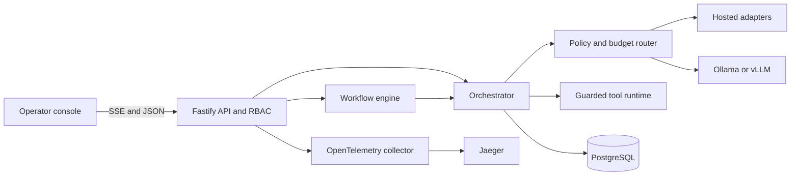

# Architecture

The contracts package is the portability boundary: adapters normalize vendor protocols, the router filters routes by tenant allowlist/privacy/capability/budget, and the orchestrator owns retries, fallback, the model/tool loop, approval suspension, redaction, persistence, traces, and usage.

Write tool calls are saved as pending approvals before execution. Approval or rejection is audited, the model loop is continued with the tool outcome, and waiting workflows are recovered. Workflow stage and artifact state are stored in PostgreSQL so queued/running work can be recovered after process restart.

Package boundaries:

- `packages/contracts`: public runtime and TypeScript contracts
- `packages/adapters`: OpenAI, Anthropic, OpenAI-compatible, local, and demo protocols
- `services/orchestrator`: policy routing, persistence, prompts, safety, traces, and usage
- `services/tool-runner`: schema validation and guarded execution
- `services/workers`: durable workflows and eval runner
- `services/api`: auth/RBAC, REST/SSE transport, rate limits, and telemetry lifecycle
- `apps/web`: authenticated operator console
